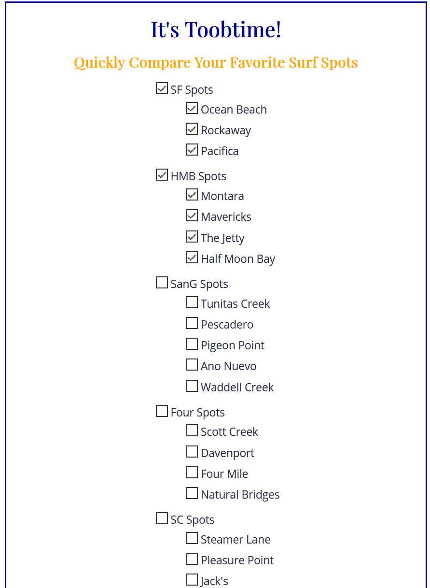
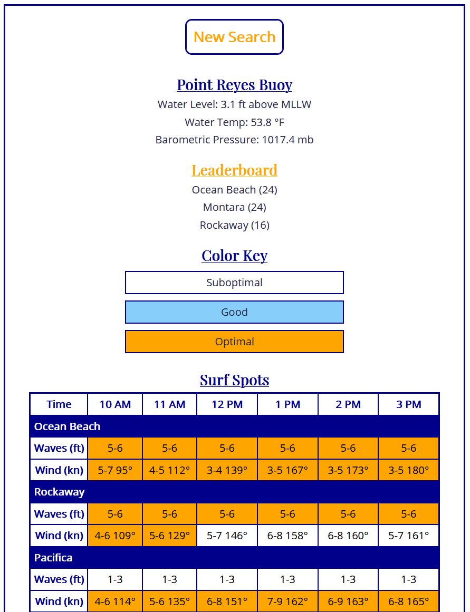

# It's Toobtime!
## Quickly Compare Your Favorite Surf Spots

## [Live Link](https://bix6.github.io/toobtime/)

**The NOAA section of this app is currently down and will display an error `responseJson.data is undefined`. The instruments at the Point Reyes station appear to be offline. I have emailed NOAA support to see what is going on.**

### About

Customizable surf report to compare spots and locate the best waves with ease.

### Technology

- Languages: HTML, CSS, JS, jQuery
- APIs: NOAA, Surfline

### Screenshot

